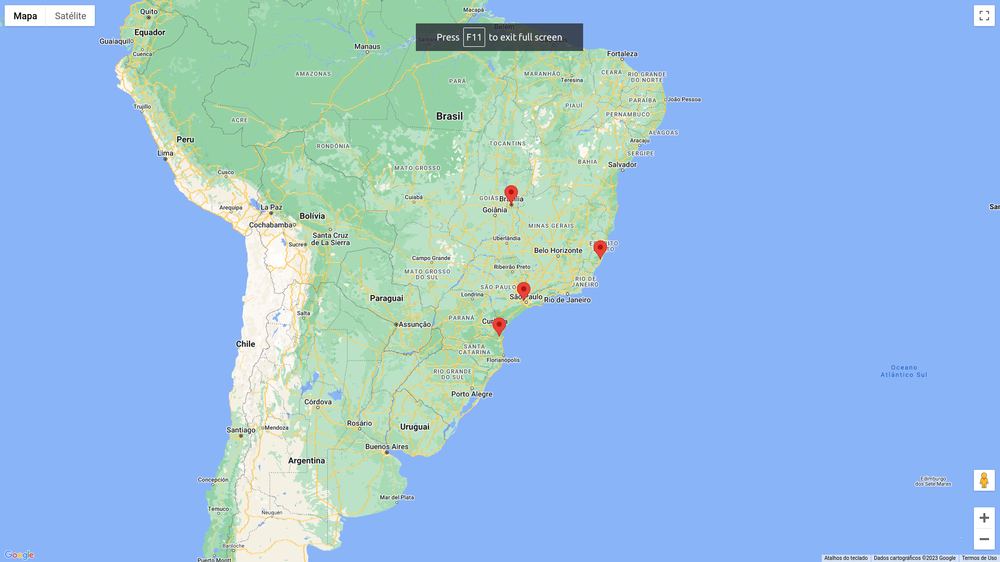

# Yssy Google Maps Challenge

## Antes de começar...

Geralmente a primeira etapa no desenvolvimento de um projeto é entender e analisar as documentações e os primeiros passos. Dito isso, seguem alguns links relevantes que podem auxiliar no processo:

- [Node.js](https://nodejs.org/en), documentação e instalação;
- [Python](https://www.python.org/downloads/), documentação e instalação;
- [Google API Key](https://developers.google.com/maps/documentation/javascript/get-api-key?hl=pt-br), geração de uma chave de API na google, para uso no desenvolvimento;
- [Google Maps](https://developers.google.com/maps/documentation/javascript/adding-a-google-map?hl=pt-br), adicionar um mapa do Google com marcadores ao seu projeto;
- [Hello World Express](https://expressjs.com/pt-br/starter/hello-world.html), projeto inicial básico em Express;
- [Hello World Flask](https://pythonbasics.org/flask-tutorial-hello-world/), projeto inicial básico em Flask.

>[KISS](https://uxdesign.blog.br/a-origem-do-keep-it-simple-stupid-kiss-b24085dc1327), entendemos que cada um possui suas prioridades e afazeres, e com isso estamos propondo esse desafio. Esperamos com esse pequeno desafio ter uma idéia geral de como você faz seus códigos, toma suas decisões envolvendo arquitetura e tentar mensurar seu conhecimento geral sobre os assuntos abordados.
## :warning: Observações
> - Mesmo que não finalize tudo, não deixe de enviar seu desafio. 

## Requisitos

1. Seu desafio precisa estar versionado no Github, em um repositório público;
2. Seu projeto deve estar documentado, pois iremos executar o projeto e entender o que foi feito pela documentação;
3. Desenvolver um _backend_ utilizando a liguagem e bibliotecas de sua preferência, com uma rota _HTTP GET_ que retorne os dados de um arquivo _json_ ["Banco de Dados"](places.json) - presente nesse repositório;
4. Desenvolver um _frontend_ (página web) utilizando a liguagem e bibliotecas de sua preferência, que possua um componente ou elemento _HTML_ integrado com a API de mapas da Google;
5. Realizar uma requisição _HTTP_ a partir do _frontend_ para o _backend_ e criar "marcadores" no mapa com base nos dados recebidos.

O resultado final deve ser algo parecido com a seguinte imagem: 

## :bulb: Dicas importantes

- Os links disponibilizados podem e devem ser utilizados para auxiliar no entendimento e desenvolvimento;
- Escolha bem as bibliotecas que irá utilizar, **não é obrigatório o uso das bibliotecas sugeridas na dinâmica**, muitas vezes ir pelo caminho já conhecido é a melhor decisão;
- A primeira etapa é conseguir entender a biblioteca que irá utilizar, por isso sempre comece por um `Hello World`;
- Para evitar que precisem subir um Banco de Dados na sua máquina, adicionamos o arquivo [places.json](places.json) no repositório com os dados a serem utilizados, não esqueça de utilizá-lo;
- Tente primeiro replicar o exemplo de mapa fornecido pela Google e posteriormente realize a integração com o _backend_;